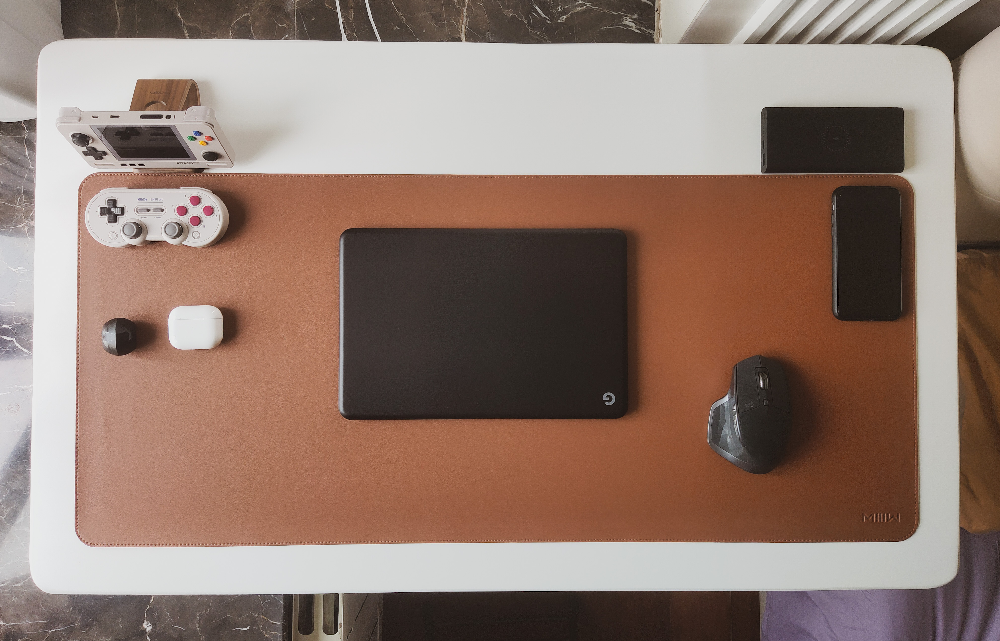
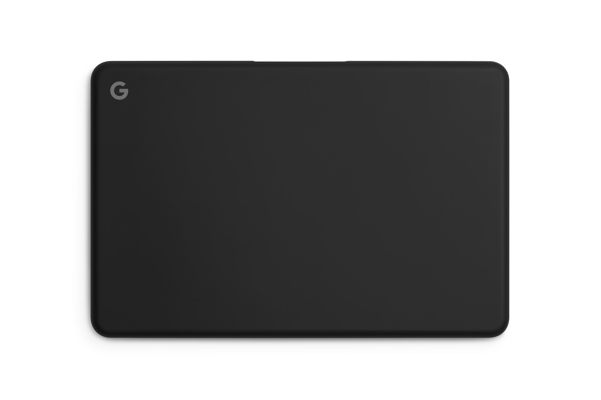
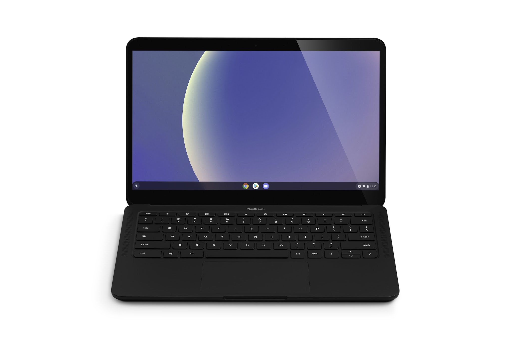
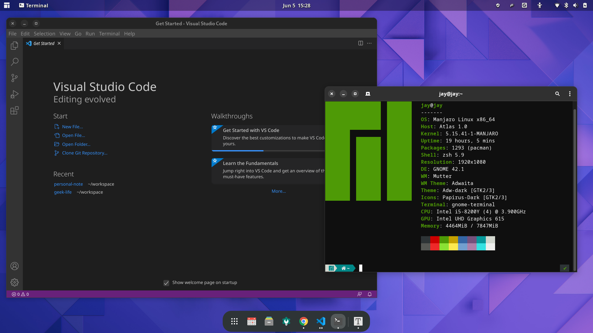
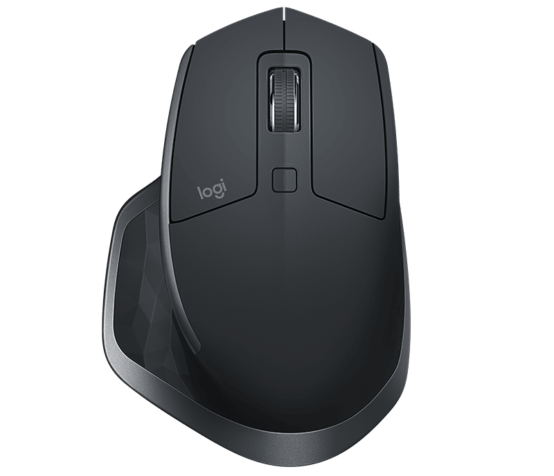
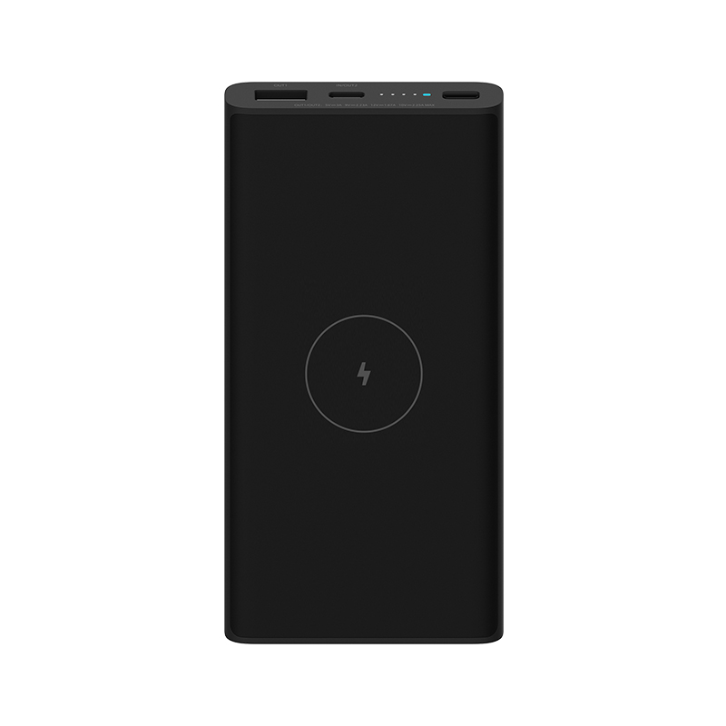
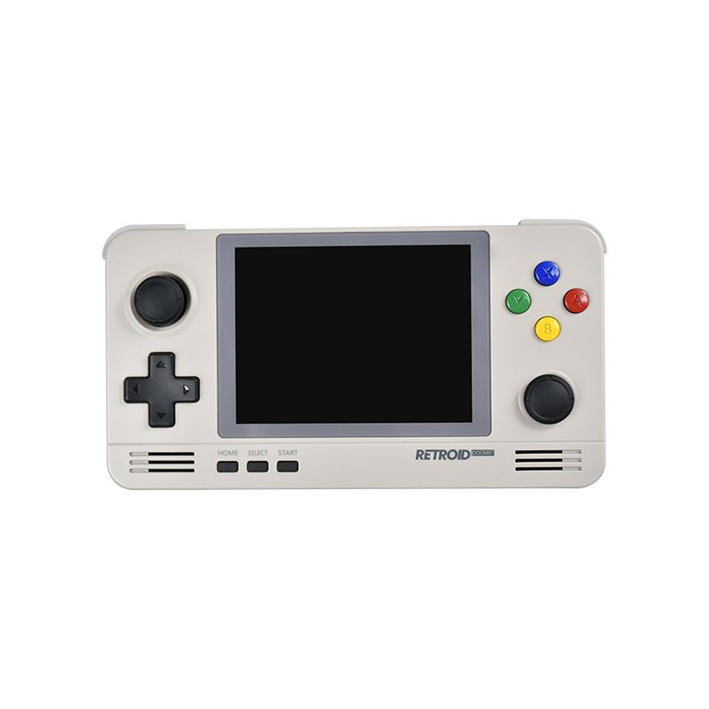
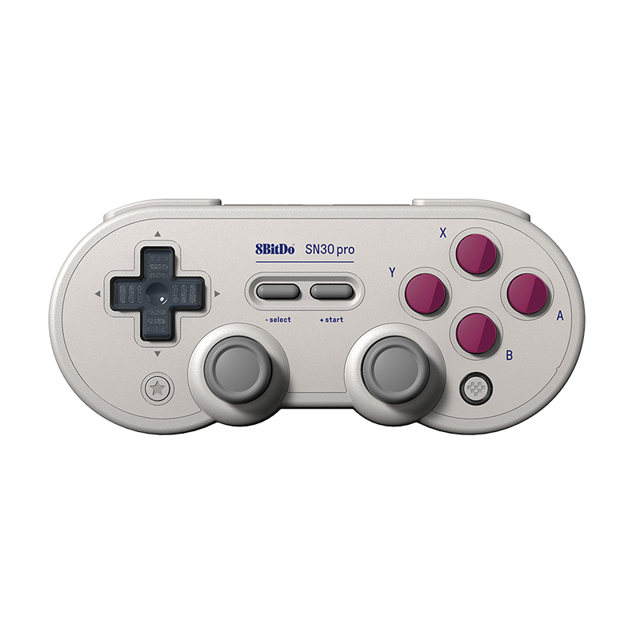
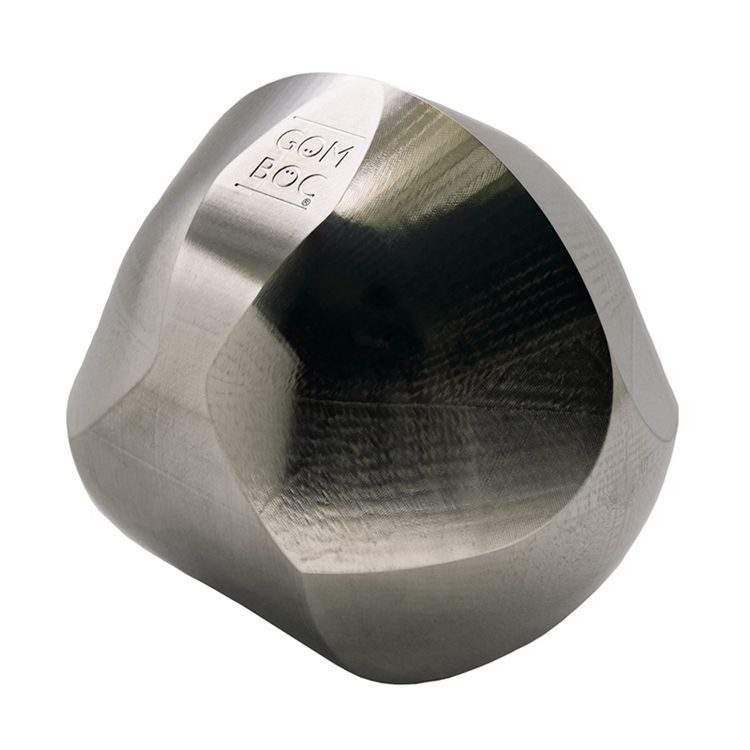

# 桌面搭建 1.0

拥有一个良好的办公环境，可以让我们的工作效率提升而且有好的工作心情，在工作（以电脑工作为主的）中我们不可缺少的是桌面，再加上最近几年疫情居家办公有时候成了常态，所以搭建一个好的桌面环境是有必要的。

那么我的桌面1.0版本，以简约为核心理念，本人喜欢各种掌机、电子产品，所以主题选择了黑、灰、白经典颜色，当然这个桌面主力设备就是我的笔记本电脑，然后在加上一些常用电子设备和娱乐电子产品，接下来就逐个介绍一下。

## 桌面全景

整个桌面分三块区域，中间也是最重要的区域办公区，这个区域摆放了一台生产力工具笔记本电脑和鼠标，办公区域也是整个桌面的重中之重。右上角是辅助区，这个区域摆放了一个无线充电器和手机。左边是娱乐区，这个区域摆放了一台开源掌机、复古游戏手柄、冈布茨和无线耳机。整个桌面以简洁为核心，但又要凸显出极客的气质。

另外还有一个重要的物品，一个大的鼠标垫，选择这种棕色可以将白的桌面和灰、黑色物品隔离开，而且让背景没有那么单调。

## 办公区

办公区域最重要的就是这台笔记本电脑，作为我的重要生产力工具，它非常与众不同，我选择了小众的 Pixelbook，而且对它的操作系统做了很大的改动，也是刷了小众的 Linux 系统。

### Pixelbook Go

Pixelbook Go 在 2019 年年底发布，它主打独特的低调的造型和特有的 ChromeOS 系统。我之所以选择这台笔记本作为主力生产力，就是因为它的造型低调而又散发着科技风，它非常的轻薄（厚度 13.4mm，重量 1.061Kg），采用镁金属材料摸上去有一种特别感觉。键盘的感受非常好，键程适中而且非常安静，它与苹果系列键盘感受完全不一样，但又非常舒适。屏幕是一块 1080P 的 13 寸触摸屏，对于我这样以文字和编码工作为主的人已经够用。触摸板虽然说滑动过程有这苹果触摸板的感受，但是点击起来由于采用的机械部件，这方面和苹果的感受有非常大的差距，不过我用中高端的鼠标可以解决这一问题。硬件方面，采用一颗第八代的 i5 CPU 和 8G 内存，已经足够我使用（系统被我刷成了 Linux），至于硬盘对我这种科技工作者来说大小并不是问题，因为我的文件存储是采用个人搭建的 NAS 系统来完成的。

Pixelbook Go 笔记本搭载的是谷歌的 Chrome OS，这种基于 Web 的操作系统虽然概念不错，但是由于生态问题，很多生产力和娱乐工具不能在上面使用。谷歌还是想要发挥出 Chrome OS 的影响力，将 Android 和 Linux 容器硬生生的塞进去，想通过 Android 的娱乐生态加上 Linux 的生产力生态打造一个全能操作系统，这种做法的结果只能让这个系统成为一个“四不像”，各种套娃操作的让我觉得 Chrome OS 系统至少现在不够成熟。

但这也阻止不了一个科技工作者的“工匠精神”，让系统好用又要与众不同，于是通宵达旦解决各种限制后，将系统刷成了 Manjaro 系统（Linux 的一个发行版本），Linux 系统是“极客”作为生产力工具的最爱，它自由、开放、定制化程度高，可以打造成功能齐全而且界面不亚于 MacOS 的系统，可玩性非常高，但又需要有一些动手能力。

### 逻辑 MX Master 2S

鼠标本着不求最好，但求舒适的原则，选择了当年逻辑的顶级鼠标（现在已经出 3S 了），在价格上已经是当初的一半了，不过使用起来绝对还是那么顺手，人体工学的握持不会让你觉得手累，各种滚轮和自定义按键功能齐全，另外它可以支持 3 个设备随时切换。这款鼠标不需要多做介绍，网上的测评到处都是，鼠标作为一个辅助工具，用得顺手就好。

## 辅助区

辅助区其实很简单的摆放了一个无线充电器和常用手机，满足日常设备充电即可，但为了能够将桌面的充电线数量减到更少，无线充电设备是首选。另外手机的话就不多做介绍了，非常常见的工具。未来想把这款区域打造成一个集成了充电、存储、时钟、温度、湿度等多功能的工具台，这块区域有待进一步升级，毕竟现在是 1.0 版本。

## 娱乐区

娱乐区是我在工作之余放松的物件，作为一个 80 后，对经典掌机、FC、SFC、PSP、街机等游戏情有独钟，平时也收集这些游戏机设备，所以我放了一款开源掌机，它采用经典 Gameboy 配色，而且内部安装了上千款经典老游戏。当然要想有好的游戏体验，游戏手柄也不能缺少。另外，在工作中或者想要找点灵感，配备好的耳机来几首歌曲也是有必要的。最后，还需要一个摆件，在工作中经常有难题，用它来解压是绝佳的神器。

### Retroid 开源掌机

这款开源掌机是我消遣的利器，超级玛丽、魂斗罗、拳皇、快打旋风、最终幻想这些经典游戏都是我们 8090 儿时的回忆，这些电子游戏让我们的童年充满了快乐和幻想。现在开源掌机的确能够满足我们的需求，它能够将所有不同类型的游戏全部集成到一个小小的设备里，这台 Retroid 开源掌机，采用经典的 Gameboy 配色，内部的一套游戏系统包揽的历史上主流的游戏模拟器，而且内置了游戏市场，可以下载到丰富的游戏资源，当然你也可以自己从其他地方找到游戏资源简单的放入存储卡就能使用，这款开源掌机从外观到功能上都满足我的个人诉求。

### 八位堂游戏手柄

有了丰富的游戏资源还不够，能够让游戏有更好的体验，那肯定需要一个灵活的手柄，这款 SN30 Pro 手柄从外观到使用手感上，的确让我找到了童年的感觉。这款游戏手柄外观也是经典 Gameboy 配色，和我的开源掌机天然配对，无线蓝牙的链接方式可以让他链接各种设备，未来如果娱乐区有所升级的话，它应该会成为保留设备。手感和做工可以算是还原了任天堂经典做工，按键舒适，摇杆灵活，而且还有震动的功能，让我的游戏体验更上一层楼。

### 冈布茨

把件或者摆件，是男人的解压工具，其实这类产品很多：指尖陀螺、无限魔方、核桃、串之类的，我之所以选择冈布茨，是因为它是世界上首个只有一个稳定平衡点和一个非稳定平衡点、且两个点在同一平面上的均质物体（只有理工男能够体会到），把它当做摆件技能在帮助我释放压力，又能够体现出“极客”的风范。不过呢，如果买一个正版的需要3000大洋，只好在网上搞了个3D打印版本，几十块就搞定了，如果有一定的追求同学，可以来一个原版的。

### AirPods 耳机

娱乐放松，寻找灵感，一副好的耳机肯定是不可缺少，苹果的 AirPods 就不多做介绍，音质、做工、生态方面不说尖端也算一流。

## 总结与改进

1.0版本桌面的桌面按照简洁风搭建，但是每个物件/设备的选择却没有那么简单，尽量保证每个物件/设备在使用体验是一流的，另外还需要保证它的独特性，有些物件的确小众，但它能够胜任各种工作而且做工优良。整体颜色的使用上也不会太多，遵循经典的黑白灰色，但是这样保守的颜色搭配的确让桌面有一些沉闷，或许在接下来的改造过程中需要一个明确主题，例如：游戏主题、科技、商务等等，这样会让整个桌面更加充满生机。

### 改进计划

整个1.0版本基本已经达到预期，桌面简洁，各个功能区域满足基本需求。那么接下来的版本中，还需要进一步改进，有这样几点改进计划：

* 升级辅助区域，成为一个多功能工具台：充电、存储、环境检测等。
* 新增供电设备，工作中的各种电源设备需要优雅整洁的整合在一起，做到桌面无线。
* 新增显示区域，无论工作还是娱乐，需要一个大屏幕。
* 隐藏式的收纳，未来设备物件越来越多，如何做到随用随取，又能隐藏的收纳起来。