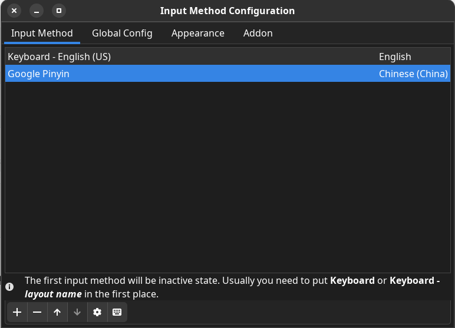
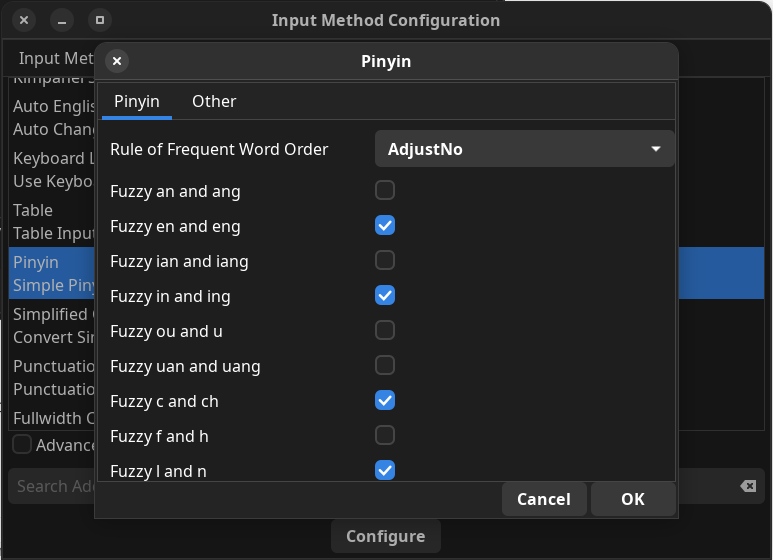
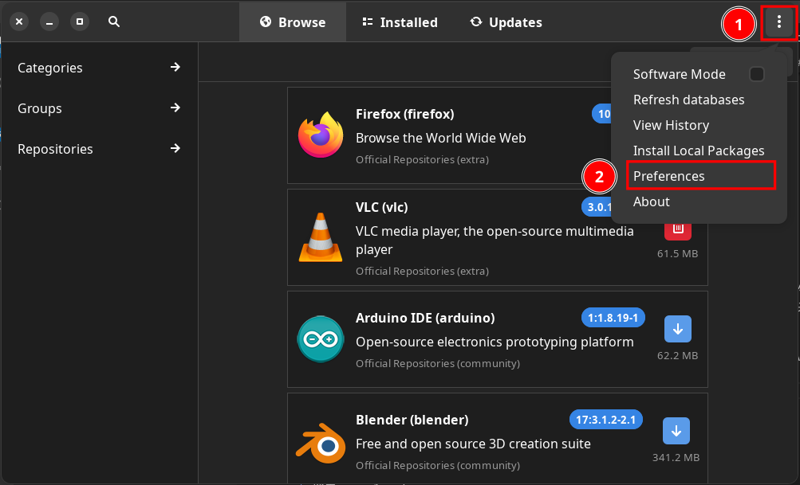
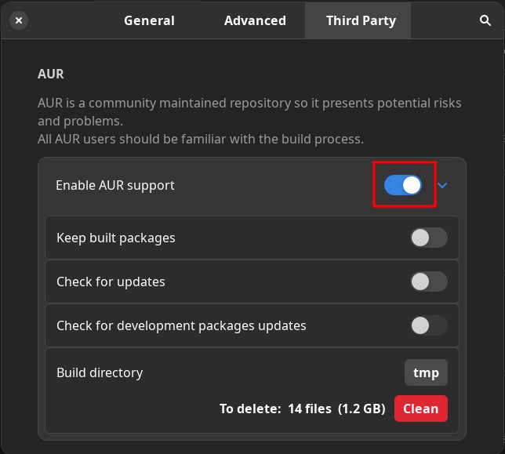
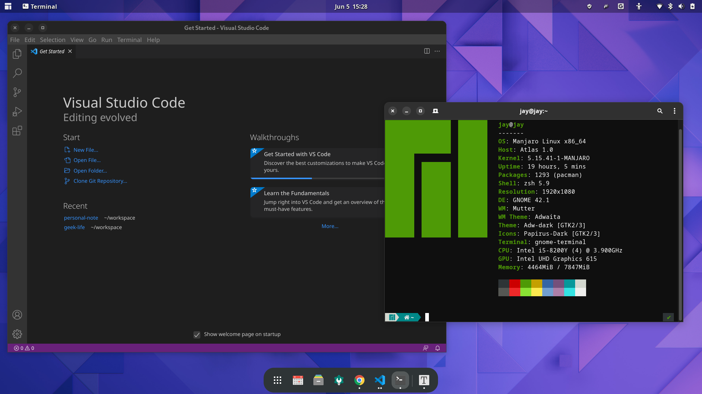

# 玩转 Pixelbook 之运行真正 Linux

既然选择了与众不同的 **Pixelbook Go**，而 ChromeOS 使用起来有那么蹩脚，那么在操作系统上作为“极客”的我也要把它换成与众不同的 Linux。

## 为什么要从 ChromeOS 接换到 Linux

体验了 ChromeOS 后，个人感觉它为了能够丰富系统的生态，强硬的将 Android 和 Linux 容器塞如到 ChromeOS 系统中去，试图让 Android 的娱乐与 Linux 的生产力融入到 ChromeOS 系统，让更多的用户接纳它，但结果让原本基于 WebApp 的操作系统成了一个“四不像”。作为有技术洁癖的人来说，一套系统、一个解决方案才是最重要的，当然我可以选择刷黑苹果或者Windows系统，但是作为“极客”的我，还是需要体现出与众不同，既然在硬件上选择了一个小众的 Pixelbook，那么操作系统也需要与众不同，于是选择了将它刷成 Linux。

## 让 ChromeOS 从 U 盘启动

ChromeOS 想要把他换掉，开启 U 盘启动并引导到其它操作系统上，整个过程相当复杂。

TODO：这部分需要一些图文

### 进入开发者模式

* 开机按组合键`esc`+`刷新/F3`进入 Recovery 界面。
* 当看到“Please insert a recover USB stick”字样界面，组合键`ctrl`+`d`进行接触系统检查限制。
* 当看到“To turn OS verification OFF, press ENTER”字样界面，按`enter`关闭系统验证。
* 此刻等待，“嘟”的响声，后等待重启。
* 进入到“Preparing system for Developer Mode”字样界面，等待系统进入开发者模式。
* 系统重启，需要重新激活进入系统，这样就打开了开发者模式。
* 进入系统后按组合键`ctrl`+`alt`+`t`，进入 crosh 模式。
* 在命令行中，输入`shell`进入命令命令行模式。

### 通过固件脚本让 ChromeOS 设备从 U 盘启动

这个部分非常专业，由于 ChromeOS 设备的固件只认识 ChromeOS，所以重刷新的系统时必须打破这个限制，这个过程相当复杂，但这也挡不住“极客”的好奇心，牛人已经做好了相关脚本，可以让你直接在 ChromeOS 的开发者模式中运行，并让设备通过 U 盘启动非 ChromeOS 的系统，脚本链接：<https://mrchromebox.tech/#fwscript>。

根据这篇文章，我们可以简单的命令行就能完成整个操作：`cd; curl -LOk mrchromebox.tech/firmware-util.sh && sudo bash firmware-util.sh`。

但不幸的是，在开发者模式中，由于通过手机搭梯子 DNS 解析的原因，无法下载`mrchromebox.tech`域名下的文件，但这点小问题难不住“极客”，于是把文件通过浏览器下载下来后，放入用户目录运行，正要开心起来的时候，问题又来了`Error downloading one or more required files; cannot continue`。怎么办！“极客精神”驱使自己去看`firmware-util.sh`的源码，源码就不解读了，具体解决方案如下：

* 如果网络有问题（无法在 ChromeOS 上搭梯子的情况）的情况，做如下操作：
  * 手动下载：`firmware.sh`、`functions.sh`、`sources.sh`3个文件。
  * 将这3个文件放入`/usr/local/bin`文件夹。
  * 修改脚本，将下载文件过程注释掉。
* 运行脚本，终于出现了正确的界面。
* TODO：如何选择
* 选择`r`重启，接下来就会从 U 盘读取你准备好的系统镜像。

非常感谢这两个视频的作者：

* <https://www.bilibili.com/video/av795919629/>
* <https://www.youtube.com/watch?v=Nzp_fmG4QRA>

## 刷机

只要能够通过 U 盘启动，刷机过程还是比较顺畅的，我这里选择的 Linux 系统是最近比较流行的基于 Arch 架构的的 Manjaro，当然它的版本比较多，我直接选择了有现代化 UI 的 Gnome 版本。Manjaro 安装过程比较轻松简单：

* 下载系统：
  * 下载地址：<https://manjaro.org/download/>。
  * 我选择的是 Gnome 版本。
* 制作镜像：
  * 我采用的是 balenaEtcher：<https://www.balena.io/etcher/>。
  * 安装好 balenaEtcher 后，插入 U 盘。
  * 选择镜像->选择 U 盘->Flash。
* 将制作好的启动盘，插入机器（需要和上面开启 ChromeOS 从 U 盘启动关联起来）。
* 机器会从 U 盘开始启动，一串代码闪过后进入安装界面。
* 选择默认项，开始各种设置：语言、时区等。
* 接下来就是无脑操作了，按照界面提示选择就行，整个安装过程比较快，大概10多分钟。

## 设置国内镜像源

由于系统默认的是国外镜像源，国内安装软件访问国外网络比较慢，另外也有可能网络被墙，换成国内源安装软件更加方便：

* 更改源命令，会弹出选择源对话框，选择网速好的源
  * `sudo pacman-mirrors -i -c China -m rank`
* 在 `/etc/pacman.conf` 中添加 `archlinuxcn` 源
  * `sudo gedit /etc/pacman.conf`
  * 在配置文件最后添加

```text
[archlinuxcn]
SigLevel = Optional TrustedOnly
Server = https://mirrors.tuna.tsinghua.edu.cn/archlinuxcn/$arch
Server = https://mirrors.sjtug.sjtu.edu.cn/archlinux-cn/$arch
Server = https://mirrors.ustc.edu.cn/archlinuxcn/$arch
```

* 安装 archlinuxcn-keyring
  * `sudo pacman -Sy archlinuxcn-keyring`
* 更新系统
  * `sudo pacman -Syyu`

## 安装输入法

在 Linux 生态中，输入法还是 `Fcitx`，一款输入法框架，它为 Linux 系统提供一个灵活的输入方案：

* Delete Fcitx
  * `sudo pacman -Rs $(pacman -Qsq fcitx)`
* 安装 Fcitx
  * `sudo pacman -S fcitx-im`
* 安装配置工具
  * `sudo pacman -S fcitx-configtool`
* 安装 Google 拼音输入法
  * `sudo pacman -S fcitx-googlepinyin`
* 配置环境变量
  * `sudo gedit ~/.pam_environment`

```text
GTK_IM_MODULE=fcitx
QT_IM_MODULE=fcitx
XMODIFIERS=@im=fcitx
```

* 重启

接下来就可以通过输入法配置工具，来配置想要的输入法了。




### 模糊拼音

位置：fcitx-configtool -> addon -> Pinyin(Simple pinyin for fcitx)



### Fcitx5

* https://zhuanlan.zhihu.com/p/468426138
* sudo pacman -S fcitx5 fcitx5-configtool fcitx5-qt fcitx5-gtk fcitx5-chinese-addons fcitx5-material-color kcm-fcitx5 fcitx5-lua
* ibus:https://linuxacme.cn/559
* https://zhuanlan.zhihu.com/p/463866526
* echo $XDG_SESSION_TYPE

## 如何安装软件

Manjaro 系统提供了两种安装软件方式：一个是通过 `pacman -S soft-name` 命令行的方式来安装；另外还提供了一个软件管理工具 `Add/Remove Software` 通过图形化界面来安装。具体按照自己的偏好来做选择，当然有一些软件如果没有发布到软件镜像源，那只能通过命令行方式来安装了。

### 开启第三方 AUR（Arch User Repository）

当然，软件管理工具默认情况下是不允许第三方软件源在里面查询到的，当我们开启第三方 AUR 后，我们可以搜索到更多的软件并安装：





安装过程也很简单，用 Chrome 浏览器作一个例子：

* 搜索 google-chrome
* 选择，并点击安装

## 推荐应用

Manjaro 提供的软件非常丰富，直接通过`Add/Remove Software`也可以顺利的安装，完全可以满足日常工作娱乐，以下介绍的常用软件，附带软件包真实名称，例如：VSCode，其实软件包的名称为`visual-studio-code-bin`，通过全名搜索更加准确。

### 系统工具

* Neoftech： neofetch
* i-nex
* 截图：flameshot

### 办公应用

* Typora：typora
* VSCode：visual-studio-code-bin
* VSCodium
* Vim：Vim(gvim)
* Xmind：xmind
* Notes：<https://www.get-notes.com/>
* WPS：wps-office <https://www.wps.com/office/linux/>
* 滴答清单：dida-bin

### 娱乐应用

* 网易云音乐：netease-cloud-music
* QQ音乐：qqmusic-bin
* Spotify：spotify
  * 在国内不太好注册
* Amberol：amberol
  * 注意：全量更新系统软件时，需要先忽略此软件，因为安装此软件需要翻墙
* Clash：clash-for-windows-bin
  * 安装失败提示有两个依赖，需要单独先安装
* 微信：wechat-uos

### 软件开发

* Nodejs
  * sudo pacman -S nodejs
  * sudo corepack enable

## 系统设置

Linux 系统和是市面上常用的操作系统（Windows，MacOS）有所不同，它的使用对象是对计算机更加专业的人使用的，倍受极客的追捧，Linux 设计的初衷也是开放、自由的，所以很多酷旋的软件都是在 Linux 上产生的，因为 Linux 和常用操作系统不一样的是：Linux 就像一个乐高积木，需要用户基于底层规则搭建属于自己的操作系统。你的桌面、工具、软件可以自己来定义，个性化能力非常强，有的高手甚至不需要图形界面就能完成很多事情。

我们通过一些系统设置，可以让系统为自己发挥更大的效率。

TODO：以下都需要一些图片

### 键盘映射

由于工作的时候使用的是 MacOS，在快捷键上调整成和 MacOS 的规范，这样两个操作系统可以顺畅的切换。

* 位置：Tweaks -> Addtional Layout Options -> Alt and Win behavior -> Ctrl is map to Alt, Alt to Win

### 主题

* 黑暗/白天主题切换
  * 位置：Settings -> Appearance -> Style -> Light

* Dash to Dock
  * 位置：Extensions -> Dash to Dock -> Settings -> Appearance
* Transparent Top Bar
  * <https://extensions.gnome.org/extension/3960/transparent-top-bar-adjustable-transparency/>
  * https://extensions.gnome.org/

### 字体

终于知道当初乔布斯为什么跟操作系统过不去了，Linux 如果不好好设置中文字体，文字看起来真的是非常蹩脚，或许是使用 Mac 系统时间长了，看了不对其、不等宽、不优雅的字体很不舒服。于是捣鼓了一下，以下设置或许不是最好，但是比默认值好很多了。推荐文本使用来自 Google 的开源免费`Noto Sans Mono`字体。

* 位置：Tweaks -> Fonts
  * 默认设置
    * Interface Text : Noto Sans Display Reguar 11
    * Document Text: Sans Reguar 11
    * Monospace Text: Hack Reguar 11
    * Legacy Window Titles: Cantarell Bold 11
    * Scaling Factor: 1.0
  * 改为
    * Interface Text : Noto Sans SC Reguar 11
    * Document Text: Noto Sans SC Reguar 11
    * Monospace Text: Hack Reguar 11
    * Legacy Window Titles: Cantarell Bold 11
    * Scaling Factor: 1.1
* VSCode 字体
  * 位置：Setting -> Editor:Font Famliy
  * 默认设置：'Droid Sans Mono', 'monospace', monospace
  * 改为：'Noto Sans Mono Regular', 'monospace', monospace
  * Droid Sans Mono Regular
  * Noto Sans Mono Reguar：这个字体有些问题，很多字看起来比较奇怪：`将`、
  * Noto Sans Mono CJK SC Regular
  * Noto Sans Mono CJK SC（推荐）

### 远程文件夹访问

* 位置：Files->Other Locations

### 蓝牙启动开启

修改蓝牙配置文件：`sudo vim /etc/bluetooth/main.conf`，将`AutoEnable`开启就可以了：

```text
# AutoEnable defines option to enable all controllers when they are found.
# This includes adapters present on start as well as adapters that are plugged
# in later on. Defaults to 'false'.
AutoEnable=true
```

## 待解决问题

* 声音问题
  * 这个问题可能和硬件以及驱动有关，需要进一步研究。但是有一个临时解决方案，就是用蓝牙耳机（蓝牙音箱）连接，暂时解决声音的问题。
  * <https://github.com/pingud98/pixelbookgohardware>
  * <https://forum.manjaro.org/t/audio-not-working-after-system-upgrade/110789>
  * <https://forum.garudalinux.org/t/audio-problem-manually-installed-pulseaudio-conflicts-with-pipewire/11477/18>
  * <https://blog.csdn.net/qq_43497702/article/details/104370104>
  * manjaro-pipewire
    * pipewire-jack
  * manjaro-pulse
  * 设置的声音输出显示：dummy output
* 触控板
  * 触摸板感觉用起来非常奇怪，不知道是驱动问题还是软件调教问题，还有待研究。
  * 现在暂时用蓝牙鼠标来解决这个问题。
  * xf86-input-synaptics

以下是最终成品截图：


